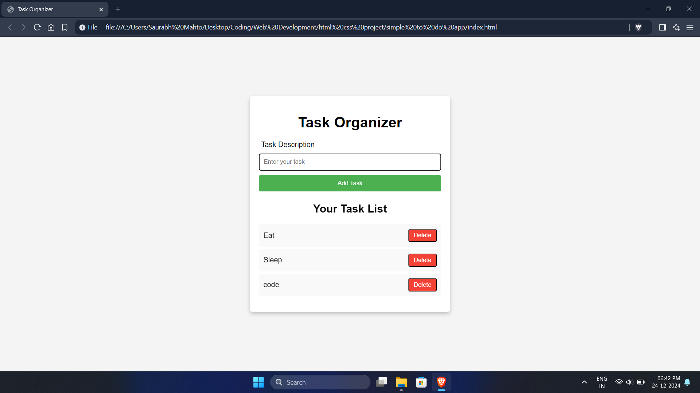

# 📝 Simple To-Do List  

A *Simple To-Do List* web page to help you manage your daily tasks efficiently! 🚀  

---

## 🌟 Features  
- ➕ Add tasks to your to-do list.  
- ✅ Mark tasks as completed.  
- ❌ Remove tasks once done.  
- 💻 Clean and user-friendly interface.  

---

## 🛠 Technologies Used  
- HTML5  
- CSS3  
- JavaScript  

---

## 🚀 How to Use  
1. Clone this repository:  
   ```bash
   https://github.com/Saurabh-Mahto/to-do-list.git

2. Open the index.html file in your browser.


3. Start adding, completing, and deleting tasks! 🎉


---

📂 File Structure

📂 File Structure
📦 To-Do List  
├── 📄 index.html     
├── 🎨 style.css      
└── 🧠 script.js     


---

📸 Preview





---

🌟 Future Enhancements

🕒 Add due dates for tasks.

🔔 Add notifications for pending tasks.

🎨 Customize themes for the app.


---

🧑‍💻 Author

Saurabh Mahto

GitHub: Your Profile


---

⭐ If you like this project, give it a star! 🌟
